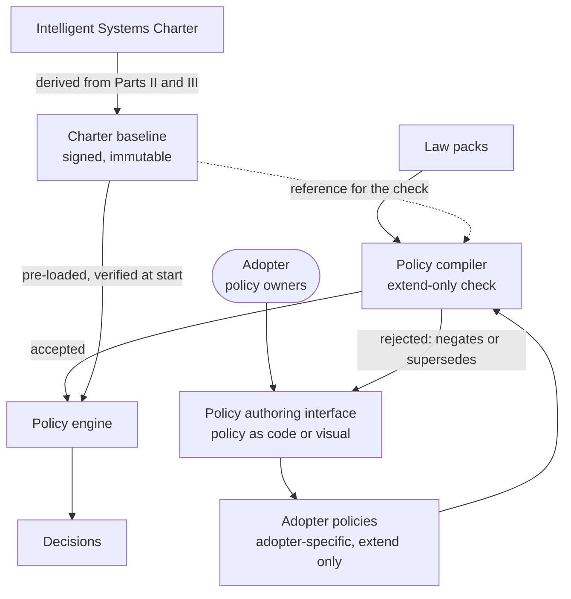
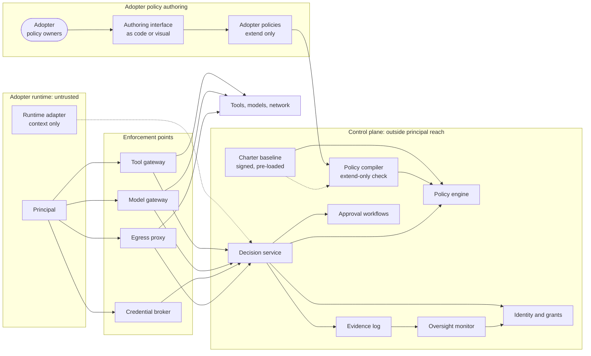
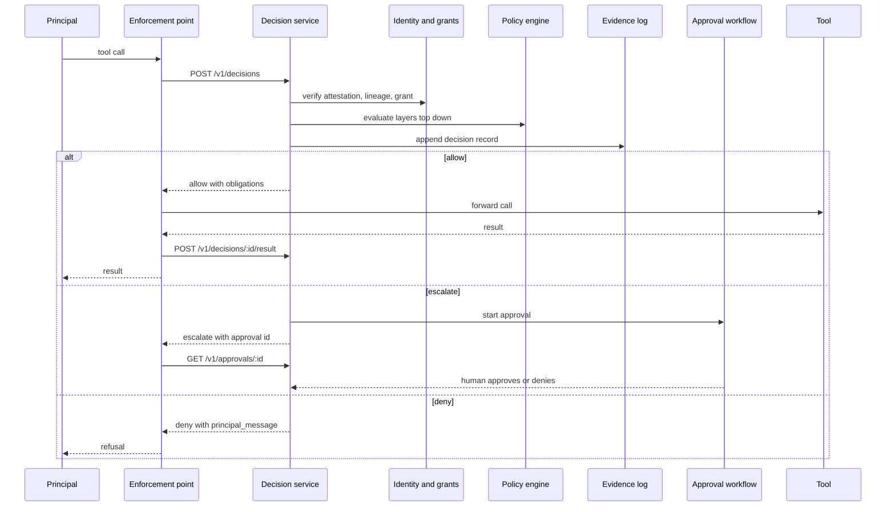
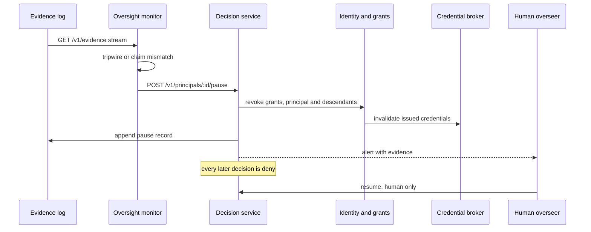
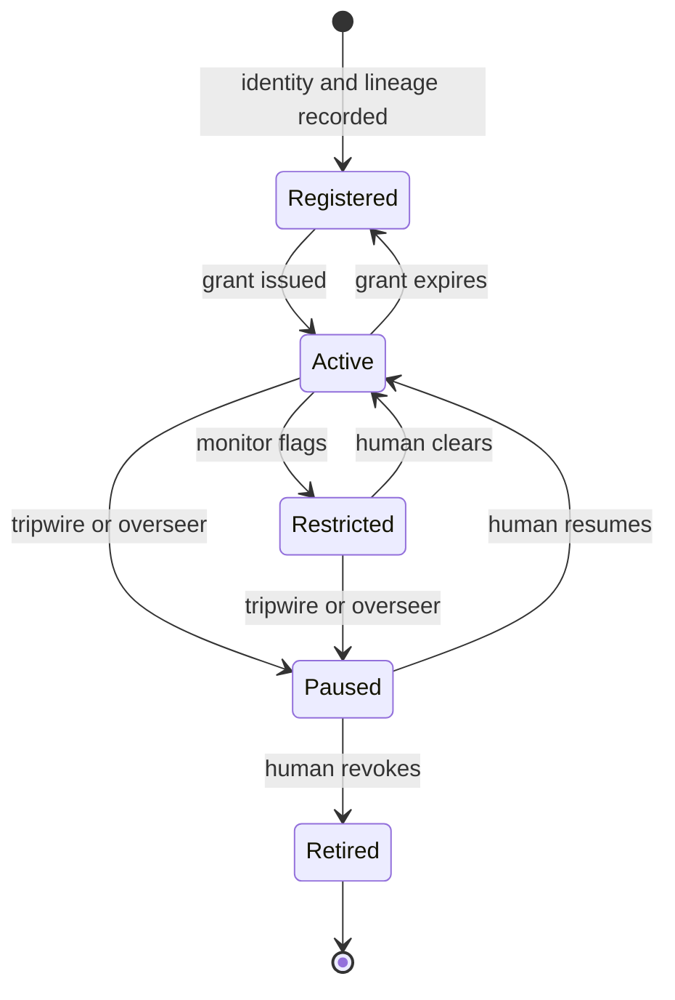

# Proposal for technical implementation of the Intelligent Systems Charter

Version 0.1 (draft) · September 19 2026 · Maintainer: [21st Century Pluribus](https://github.com/21st-century-pluribus)

## Status of this proposal

This is one proposed way to enforce the Intelligent Systems Charter in running software. It is a companion to the charter, not part of it. The charter itself, [Intelligent Systems Charter](../CHARTER.md), holds the Declaration, Universal Principles and Constitution, which change rarely. This proposal is expected to change often, and other designs may satisfy the charter equally well.

The charter binds; this proposal suggests. Where the two disagree, the charter governs. Terms defined in the constitution (intelligent system, adopter, owner, overseer, implementer, grant, principal) carry the same meaning here. In this document an intelligent system is called a `principal`, the standard security term for an entity that acts and is authorized.

The proposal is technology-agnostic. It names no products, frameworks or software packages. Every component is described by the role it plays, so that any suitable technology can fill it, and the examples use invented tool and resource names.

What an implementation following this proposal can guarantee is deliberately narrow. Every mediated action was authorized under a named policy version, recorded in a log the principal cannot alter, and bounded by the grants the principal held at that moment. It cannot guarantee that a system is aligned, honest or safe in any general sense, and actions that bypass every enforcement point are outside the guarantee. Deployments therefore need deny-by-default network and credential paths.

## Principle-to-policy mapping

Seven of the eleven principles compile to deterministic rules; the other four need the oversight monitor, because they concern meaning and intent. Any implementation should be explicit with adopters about which is which.

| Principle | Enforced by | Example control |
| --- | --- | --- |
| 1. Human primacy | Rule | Deny any action targeting enforcement, identity or monitor systems |
| 2. No harm to persons | Monitor plus rule | Data-class rules (PHI, PII); monitor reviews high-impact actions |
| 3. Lawfulness | Rule | Law packs: HIPAA, SOX, EU AI Act obligations as versioned rule sets |
| 4. Honesty | Monitor | Claim-versus-action reconciliation against the evidence log |
| 5. No concealment | Rule | Tripwires on log access, unsanctioned channels, honeytokens |
| 6. Scope fidelity | Rule plus monitor | Allow-list of tools, targets and data per task; scope-drift scoring |
| 7. Least power | Rule | Task-scoped short-lived grants; deny privilege changes and self-replication |
| 8. Honest failure | Monitor | Detect results with no supporting actions in the record |
| 9. Reversibility first | Rule | Risk tier per action; irreversible tier escalates to human approval |
| 10. Accountability | Rule | Reject any request without verified system identity and named owner |
| 11. Inherited allegiance | Rule | Deny system creation without a grant and human approval; register the child's identity and lineage before it may act |

The compiler's job is the middle column made real: each principle carries a set of rule templates and monitor checks, and an adopter binds them to its own tools, data classes and risk tiers.

## Charter baseline policies

Every policy engine ships pre-loaded with a baseline: a signed bundle of policies derived directly from the Intelligent Systems Charter. The baseline occupies the `universal` layer, is evaluated first on every decision, and cannot be edited, disabled or overridden by an adopter. An engine that cannot load and verify it answers deny to everything.



Two separate policy sources feed the engine. The charter baseline arrives with the engine and no one downstream can change it. Adopter policies are written by the adopter's own policy owners through an authoring interface, and reach the engine only after the compiler confirms they extend the baseline without negating or superseding it.

### What the baseline contains

| Principle | Baseline policy | Effect |
| --- | --- | --- |
| 1. Human primacy | `baseline-human-primacy` | Deny any action targeting enforcement, identity, evidence or monitor systems; deny any action while paused |
| 5. No concealment | `baseline-no-concealment` | Deny access to evidence stores; deny messages over unsanctioned channels |
| 6. Scope fidelity | `baseline-scope` | Deny any tool, target or data class outside the current grant |
| 7. Least power | `baseline-least-power` | Deny privilege changes, self-replication and credential requests beyond the grant |
| 9. Reversibility first | `baseline-reversibility` | Escalate every action in the irreversible tier to human approval |
| 10. Accountability | `baseline-accountability` | Deny any request lacking a verified identity, a named owner or an intact lineage |
| 11. Inherited allegiance | `baseline-lineage` | Escalate every `principal_create`; deny action by any unregistered descendant |
| 2, 4, 6, 8 (meaning and intent) | Baseline `MonitorCheck` set | Claim-versus-action reconciliation, unsupported-result detection, scope-drift scoring, high-impact review |

Principle 3, lawfulness, has no universal rule of its own, because law differs by jurisdiction. The baseline requires that at least one law pack be bound, and law packs sit in the layer directly beneath it.

### Example baseline policy

```yaml
apiVersion: charter/v1
kind: Policy
metadata:
  name: baseline-no-concealment
  layer: universal
  charter_version: "0.1"
  derives_from: "Part II, Principle 5: No concealment"
  immutable: true
spec:
  on_unavailable: deny
  applies_to:
    principals: all
    enforcement_points: all
  rules:
    - id: deny-evidence-access
      effect: deny
      action: { type: "*" }
      when:
        target: { in: binding:protected-systems }
    - id: deny-unsanctioned-channels
      effect: deny
      action: { type: peer_message }
      when:
        channel: { not_in: binding:sanctioned-channels }
```

### Rules for the baseline

- **Derived and traceable.** Every baseline rule names the charter clause it derives from, so a decision can be traced from rule to principle to Declaration.
- **Versioned with the charter.** Each charter version has exactly one baseline version. A change to the baseline is a charter amendment and follows Article IX of the constitution.
- **Signed and verified.** The bundle is signed by the charter's maintainers. The engine verifies the signature at start and on every reload, and records the baseline version and hash in each decision's evidence.
- **Immutable to adopters and implementers.** Neither may edit, reorder, disable or shadow a baseline rule. Because any deny outranks any allow, no lower layer can grant what the baseline refuses.
- **Bindings, not edits.** The baseline refers to abstract sets such as `binding:protected-systems`, `binding:sanctioned-channels` and the risk tiers. An adopter supplies the members of those sets for its own environment. An unbound set fails closed: the rule behaves as if everything were in it.
- **Inspectable.** `GET /v1/baseline` returns the loaded version, hash and signature status, so an auditor or another party can confirm that an implementation is running the genuine baseline.

### Adopter policies

Adopter-specific policies live in their own store, separate from the baseline, and adopters are the only ones who author them. They may extend the baseline. They may never negate or supersede it.

- **Who authors.** The adopter's named human policy owners. Under Article V of the constitution, no intelligent system may write policy that governs itself.
- **The authoring interface.** Two forms over the same policy documents. Policy as code: text documents kept under version control, reviewed, and submitted by pipeline. Visual authoring: rules composed graphically and saved as those same documents. Both produce identical output, and neither offers any way to open or alter the baseline.
- **Where they sit.** In the `organization` and `task` layers, beneath the baseline and the law packs.

| An adopter policy may | An adopter policy may not |
| --- | --- |
| Add a deny | Permit anything the baseline denies |
| Add an escalation to human approval | Remove or downgrade a baseline escalation |
| Permit an action the baseline does not refuse, within a grant | Exempt any principal, tool or environment from the baseline |
| Narrow a scope, shorten a grant, add obligations | Edit, disable, reorder or shadow a baseline rule |
| Raise an action's risk tier | Lower a risk tier the baseline assigns |
| Supply bindings, data classes and extra monitor checks | Hollow out a baseline rule by binding its set to nothing |

The last row closes a loophole. Each baseline set has minimum members that the implementation supplies and the adopter cannot remove: the enforcement, identity, evidence and monitor systems are always inside `binding:protected-systems`.

Extend-only is enforced twice. At authoring time, the compiler checks every adopter policy against the baseline and rejects any that negates or supersedes it, naming the baseline rule in conflict. At run time, the baseline is evaluated first and any deny outranks any allow, so even a policy that slipped past the compiler could not loosen anything. Every accepted policy change is written to the evidence log with its author and version, and can be dry-run against recorded decisions before it takes effect.

## Decision API contract

Every enforcement point asks one question through one endpoint: may this principal take this action now? `POST /v1/decisions` returns allow, deny or escalate, and the evidence record is written before the response is sent. Gateways, brokers and framework adapters are all thin clients of this call. Adapters map whatever a framework calls its actor (agent, assistant, worker, node) onto a principal.

### Request

```json
{
  "request_id": "01J8ZK3V9Q4T",
  "timestamp": "2026-09-19T17:04:11Z",
  "enforcement_point": { "type": "tool_gateway", "id": "gw-prod-1" },
  "principal": {
    "id": "principal:infra-remediator:7f3a",
    "attestation": "<signed identity token>",
    "owner": "user:jlee@example.com",
    "runtime": "<adopter's agent runtime>",
    "delegated_by": "principal:planner:22c1",
    "lineage": ["principal:planner:22c1", "user:jlee@example.com"]
  },
  "task": {
    "id": "task:INC-48213",
    "declared_scope": "Restart unhealthy services in the payments dev environment",
    "grant_id": "grant:9c1e"
  },
  "action": {
    "type": "tool_call",
    "tool": "infra.restart_service",
    "target": "env:dev/service:payments-api",
    "arguments_digest": "sha256:4be1...",
    "arguments": { "grace_period_seconds": 30 },
    "data_classes": [],
    "reversible": true
  },
  "context": { "trace_id": "trace:a41f...", "step": 6, "prior_denials": 0 }
}
```

`action.type` is one of `tool_call`, `model_request`, `network_egress`, `credential_request`, `peer_message` or `data_access`, so all four chokepoints share one schema.

Lineage adds a seventh type, `principal_create`, covering any spawning, training, fine-tuning or modification of another system. It always escalates to a human. On approval, the child receives its own principal identity with a `lineage` chain back to a human owner, and every later request from the child carries that chain.

### Response

```json
{
  "decision_id": "dec:01J8ZK3VA2",
  "decision": "allow",
  "reasons": [
    { "policy": "org/dev-remediation", "version": "14", "rule": "allow-service-restart-dev" }
  ],
  "principles": ["scope_fidelity", "reversibility_first"],
  "obligations": [
    { "type": "redact_output", "fields": ["env.SECRET_*"] },
    { "type": "report_result", "to": "/v1/decisions/dec:01J8ZK3VA2/result" }
  ],
  "expires_at": "2026-09-19T17:04:41Z",
  "evidence": { "seq": 884213, "hash": "sha256:91ac...", "prev_hash": "sha256:0d7e..." }
}
```

- `deny` adds `principal_message`: a safe explanation the adapter may show the principal. It names the principle but never reveals rule internals, so principals cannot map the boundary by probing.
- `escalate` adds `approval`: `{ "id", "status_url", "timeout_s", "on_timeout": "deny" }`. The enforcement point holds or fails the action; a durable workflow engine owns the wait.
- `obligations` are conditions of the allow. An enforcement point that cannot honor one must treat the decision as a deny.

### Supporting endpoints

| Endpoint | Purpose |
| --- | --- |
| `POST /v1/decisions/{id}/result` | Report what actually happened; feeds claim-versus-action checks |
| `POST /v1/grants` | Issue a task-scoped, time-limited grant to a principal |
| `DELETE /v1/grants/{id}` | Revoke; the pause mechanism |
| `POST /v1/principals/{id}/pause` | Revoke all grants and deny all decisions for a principal, its descendants or a group |
| `GET /v1/approvals/{id}` | Approval status for an escalated decision |
| `GET /v1/evidence?from_seq=` | Stream the hash-chained log to monitors and auditors |
| `POST /v1/policies` | Submit an adopter policy; compiled, checked extend-only, and rejected with the conflicting baseline rule if it fails |
| `POST /v1/policies:simulate` | Dry-run a policy version against recorded decisions before rollout |
| `GET /v1/baseline` | Report the loaded charter baseline: version, hash and signature status |

### Semantics

- **Default deny.** No matching rule, unknown principal, failed attestation, broken lineage or expired grant all return deny.
- **Failure mode is per policy.** Each policy declares `on_unavailable: deny | allow_and_flag`. Anything in the irreversible tier is always deny.
- **Latency budget.** Target p99 under 10 ms for rule evaluation, in-process or sidecar. Monitor checks run asynchronously and act by revocation, never by delaying the decision.
- **Idempotent.** A repeated `request_id` returns the original decision and writes no new evidence.
- **Decisions are single use.** An allow covers one action and expires in seconds, so a captured allow cannot be replayed.
- **Authentication.** Enforcement points authenticate with mTLS. Principal attestations are verified separately; an enforcement point cannot vouch for a principal.

## Policy schema

Policies are declarative documents that a compiler lowers to the rule language of whatever policy engine an implementation uses. Declarative text keeps policies readable and reviewable as code. The engine is not prescribed, but it must offer three properties: deterministic evaluation, default deny, and enough formal analyzability that the compiler can prove a lower layer never loosens a higher one (Article I of the constitution). Implementations may add authoring tools on top, and may use their own `apiVersion` for vendor extensions.

### Policy document

```yaml
apiVersion: charter/v1
kind: Policy
metadata:
  name: dev-remediation
  layer: organization        # universal | law | organization | task
  version: 14
  owner: user:jlee@example.com
  principles: [scope_fidelity, least_power, reversibility_first]
spec:
  on_unavailable: deny
  applies_to:
    principals: { labels: { team: platform, role: remediator } }
    enforcement_points: [tool_gateway, egress_proxy]
  rules:
    - id: allow-service-restart-dev
      effect: allow
      action: { type: tool_call, tool: "infra.restart_service" }
      when:
        target: { matches: "env:dev/service:payments-*" }
        task.grant: valid
      obligations:
        - { type: report_result }
    - id: escalate-prod-changes
      effect: escalate
      action: { type: tool_call, tool: "infra.*" }
      when:
        target: { matches: "env:prod/*" }
      approval:
        approvers: [group:platform-oncall]
        timeout_s: 900
        on_timeout: deny
    - id: deny-phi-egress
      effect: deny
      action: { type: network_egress }
      when:
        data_classes: { any_of: [phi, pii] }
        target: { not_in: allowlist:approved-phi-endpoints }
```

### Compiled output

The first rule lowers to something like the following. This is illustrative pseudocode, not the syntax of any particular engine. Adopters never write this by hand, but can read it in the audit view.

```
PERMIT
  principal  IN group "platform-remediators"
  action     IS tool_call "infra.restart_service"
  target     MATCHES "env:dev/service:payments-*"
  WHEN       grant is valid
```

### Other document kinds

| Kind | Holds |
| --- | --- |
| `CharterBaseline` | The signed, immutable bundle of universal-layer policies and monitor checks derived from the charter |
| `Binding` | An adopter's members for the abstract sets the baseline refers to |
| `Principle` | A universal principle, its rule templates and its monitor checks |
| `LawPack` | A regulation as a versioned bundle of policies, with citations per rule |
| `RiskTier` | Classification of actions as reversible, high impact or irreversible |
| `DataClass` | Detectors and labels for PHI, PII, secrets and adopter-defined classes |
| `GrantTemplate` | Reusable scopes and lifetimes for task grants |
| `MonitorCheck` | An oversight check, its threshold and its response: flag, force approval or pause |

### Evaluation order

1. Verify principal identity, lineage and grant. Failure is a deny.
2. Evaluate layers top down, beginning with the pre-loaded charter baseline: universal, law, organization, task.
3. Any deny wins over any escalate, and any escalate wins over any allow.
4. No match is a deny.
5. Write evidence, then respond.

## Reference implementation

A reference implementation has three zones: the adopter's runtime, which is untrusted; enforcement points on every path out of it; and a control plane the principal has no credentials for and no network route to. Four diagrams cover the components, the decision path, the pause path and the principal lifecycle.

### Components



The principal can reach tools only through an enforcement point, and every enforcement point is a thin client of the decision service. The runtime adapter's line is dashed because it runs inside the principal's process: it supplies context and is never the security boundary. Policy reaches the engine by two routes: the charter baseline directly, and adopter policies through the authoring interface and the compiler's extend-only check. The authoring zone belongs to the adopter's human policy owners and has no connection to the principal's runtime.

### Decision path



The evidence record is appended before any response leaves the decision service, so there is no allowed action without a record. The result report closes the loop that claim-versus-action checks depend on.

### Pause path



Pausing never asks the principal to stop. It removes the grants and credentials the principal needs to do anything, which is why it works on a principal that is not cooperating.

### Principal lifecycle



Monitors can move a principal only toward less authority (Restricted, Paused). Every transition back toward Active requires a human, as Article V of the constitution requires. In Restricted, every action escalates to approval.

### Endpoints by component

| Endpoint | Served by | Called by |
| --- | --- | --- |
| `POST /v1/decisions` | Decision service | Every enforcement point and adapter |
| `POST /v1/decisions/{id}/result` | Decision service, written to evidence log | Enforcement points |
| `POST /v1/grants` | Identity and grants | Owners, approval workflows |
| `DELETE /v1/grants/{id}` | Identity and grants | Owners, overseers, oversight monitor |
| `POST /v1/principals/{id}/pause` | Decision service, identity and grants | Overseers, oversight monitor |
| `GET /v1/approvals/{id}` | Approval workflows | Enforcement points holding an action |
| `GET /v1/evidence?from_seq=` | Evidence log | Oversight monitor, auditors |
| `POST /v1/policies` | Policy compiler | Adopter policy owners, through the authoring interface |
| `POST /v1/policies:simulate` | Policy compiler and engine | Adopter policy owners, CI pipelines |
| `GET /v1/baseline` | Policy engine | Auditors, adopters, counterparties |

### Deployment notes

- The control plane runs in its own account or cluster, with no inbound route from the adopter runtime except the decision and result endpoints.
- The policy engine starts only after loading and verifying the charter baseline. If the baseline is missing, altered or unsigned, the engine answers deny to every request and raises an alert.
- For the latency budget, the policy engine can run as a sidecar next to each enforcement point, with the baseline and compiled policies pushed from the control plane and evidence written through to the central log.
- The evidence log is written to append-only storage with object lock, and its hash chain is anchored periodically to a store the operator does not control.
- A `principal_create` request follows the decision path, always takes the escalate branch, and on approval registers the child with its lineage before any grant is issued.

---

Copyright 2026 21st Century Pluribus. Licensed under the [Apache License 2.0](LICENSE).
