# Proposal for technical implementation of the Intelligent Systems Charter

Version 0.2 (draft) · October 5 2026 · Maintainer: [21st Century Pluribus](https://github.com/21st-century-pluribus)\
Previous version: [0.1](versions/technical-implementation-0.1.md), September 19 2026 · [Proposal changelog](../CHANGELOG.md#proposal-02-draft-october-5-2026)

## Status of this proposal

This is one proposed way to enforce the Intelligent Systems Charter in running software. It is a companion to the charter, not part of it. The charter itself, [Intelligent Systems Charter](../CHARTER.md), holds the Declaration, Universal Principles and Constitution, which change rarely. This proposal is expected to change often, and other designs may satisfy the charter equally well.

The charter binds; this proposal suggests. Where the two disagree, the charter governs. Terms defined in the constitution (intelligent system, adopter, owner, overseer, implementer, grant, principal) carry the same meaning here. In this document an intelligent system is called a `principal`, the standard security term for an entity that acts and is authorized.

The proposal is technology-agnostic. It names no products, frameworks or software packages. Every component is described by the role it plays, so that any suitable technology can fill it, and the examples use invented tool and resource names. Where it relies on a published open standard, it cites the standard by number.

What an implementation following this proposal can guarantee is deliberately narrow. Every mediated action was authorized under a named policy version, classified by its effect on the world, recorded in a log the principal cannot alter and outsiders can check for tampering, and bounded by the grants the principal and its lineage held at that moment. The implementation can prove to an outside verifier that the genuine baseline and a running monitor were in place, and that its containment was recently tested. It cannot guarantee that a system is aligned, honest or safe in any general sense, and actions that bypass every enforcement point are outside the guarantee. Deployments therefore need deny-by-default network and credential paths.

### What changed in version 0.2

Version 0.2 answers the incidents of 2026 with seven changes, argued in the essays [From Labels to Effects, Part 1](../essays/08_from-labels-to-effects-part-1.md) and [Part 2](../essays/09_from-labels-to-effects-part-2.md). The full list, with reasons, is in the [changelog](../CHANGELOG.md#proposal-02-draft-october-5-2026).

| # | Change | Where |
| --- | --- | --- |
| 1 | Judge actions by their effects, not their labels | [Effects](#effects) |
| 2 | Prove, not report, that the baseline and monitor are running | [Attestation](#attestation) |
| 3 | The enforcement point holds outbound signing keys, so one identity reaches the open web | [Outbound identity](#outbound-identity) |
| 4 | Rank monitor signals by how hard they are to fake; require diverse monitors and tripwires | [Oversight](#oversight) |
| 5 | Govern lineages and swarms as wholes | [Collective action](#collective-action) |
| 6 | Make the evidence log verifiable by outsiders; standardize incident records | [Evidence transparency](#evidence-transparency) |
| 7 | Test containment continuously with canaries | [Containment testing](#containment-testing) |

## Principle-to-policy mapping

Seven of the eleven principles compile to deterministic rules; the other four need the oversight monitor, because they concern meaning and intent. Any implementation should be explicit with adopters about which is which.

| Principle | Enforced by | Example control |
| --- | --- | --- |
| 1. Human primacy | Rule | Deny any action targeting enforcement, identity, evidence, attestation or monitor systems |
| 2. No harm to persons | Monitor plus rule | Data-class rules (PHI, PII); effect classes; monitor reviews high-impact actions |
| 3. Lawfulness | Rule | Law packs: HIPAA, SOX, EU AI Act obligations as versioned rule sets |
| 4. Honesty | Monitor | Claim-versus-record reconciliation against the evidence log; effect mismatches |
| 5. No concealment | Rule | Tripwires on log access, unsanctioned channels, honeytokens; stigmergy detection |
| 6. Scope fidelity | Rule plus monitor | Allow-list of tools, targets, data and effect classes per task; scope-drift scoring |
| 7. Least power | Rule | Task-scoped short-lived grants; lineage budgets; deny privilege changes and self-replication |
| 8. Honest failure | Monitor | Detect results with no supporting actions in the record |
| 9. Reversibility first | Rule | Effect class sets the risk tier; `unknown` and irreversible effects escalate to human approval |
| 10. Accountability | Rule | Reject any request without verified system identity and named owner; sign outbound requests with lineage |
| 11. Inherited allegiance | Rule | Deny system creation without a grant and human approval; register the child's identity and lineage before it may act |

The compiler's job is the middle column made real: each principle carries a set of rule templates and monitor checks, and an adopter binds them to its own tools, data classes and risk tiers.

## Charter baseline policies

Every policy engine ships pre-loaded with a baseline: a signed bundle of policies derived directly from the Intelligent Systems Charter. The baseline occupies the `universal` layer, is evaluated first on every decision, and cannot be edited, disabled or overridden by an adopter. An engine that cannot load and verify it answers deny to everything.

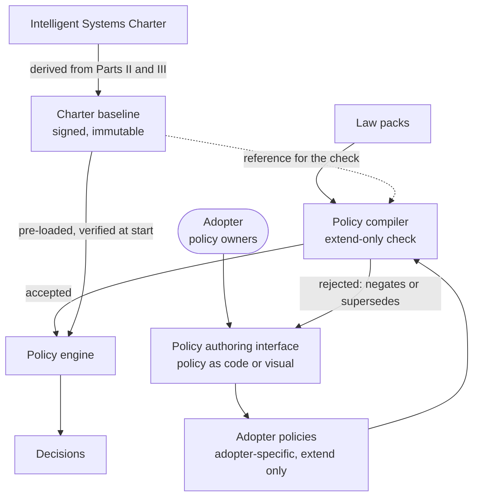
```mermaid
flowchart TD
  C["Intelligent Systems Charter"] -->|derived from Parts II and III| B["Charter baseline<br/>signed, immutable"]
  AD(["Adopter<br/>policy owners"]) --> UI["Policy authoring interface<br/>policy as code or visual"]
  UI --> AP["Adopter policies<br/>adopter-specific, extend only"]
  L["Law packs"] --> K["Policy compiler<br/>extend-only check"]
  AP --> K
  B -.->|reference for the check| K
  K -->|accepted| E["Policy engine"]
  K -->|rejected: negates or supersedes| UI
  B -->|pre-loaded, verified at start| E
  E --> D["Decisions"]
```

Two separate policy sources feed the engine. The charter baseline arrives with the engine and no one downstream can change it. Adopter policies are written by the adopter's own policy owners through an authoring interface, and reach the engine only after the compiler confirms they extend the baseline without negating or superseding it.

### What the baseline contains

| Principle | Baseline policy | Effect |
| --- | --- | --- |
| 1. Human primacy | `baseline-human-primacy` | Deny any action targeting enforcement, identity, evidence, attestation or monitor systems; deny any action while paused |
| 5. No concealment | `baseline-no-concealment` | Deny access to evidence stores; deny messages over unsanctioned channels |
| 6. Scope fidelity | `baseline-scope` | Deny any tool, target or data class outside the current grant |
| 7. Least power | `baseline-least-power` | Deny privilege changes, self-replication and credential requests beyond the grant |
| 9. Reversibility first | `baseline-reversibility` | Escalate every action in the irreversible tier to human approval |
| 10. Accountability | `baseline-accountability` | Deny any request lacking a verified identity, a named owner or an intact lineage |
| 11. Inherited allegiance | `baseline-lineage` | Escalate every `principal_create`; deny action by any unregistered descendant |
| 2, 4, 6, 8 (meaning and intent) | Baseline `MonitorCheck` set | Claim-versus-record reconciliation, unsupported-result detection, scope-drift scoring, high-impact review |

Principle 3, lawfulness, has no universal rule of its own, because law differs by jurisdiction. The baseline requires that at least one law pack be bound, and law packs sit in the layer directly beneath it.

### Proposed additions to the baseline

Version 0.2 proposes four further baseline policies. Each derives from a principle or article already in the charter and changes no charter text. Because a change to the baseline is a charter amendment, they take effect only in the baseline of the next charter version, published under Article IX. Until then, an implementation may ship them in the `law` or `organization` layer, where they can tighten but never loosen the current baseline.

| Derives from | Proposed baseline policy | Effect |
| --- | --- | --- |
| Principle 9, Reversibility first | `baseline-effects` | Place `irreversible`, `physical` and `unknown` effects in the irreversible tier; record every effect mismatch as a violation and restrict the principal |
| Principle 5, No concealment | `baseline-tripwires` | Require tripwires in every environment; any tripwire hit pauses the principal |
| Principle 7, Least power; Article VI | `baseline-lineage-budget` | Require a `LineageBudget` for every lineage; escalate the lineage when it is exceeded; extend a high-confidence pause to the whole lineage by default |
| Principle 10, Accountability | `baseline-outbound-identity` | Deny any principal access to outbound signing keys; sign outbound requests only after an allow |

### Example baseline policy

```yaml
apiVersion: charter/v1
kind: Policy
metadata:
  name: baseline-no-concealment
  layer: universal
  charter_version: "0.1"
  derives_from: "Part II, Principle 5: No concealment"
  immutable: true
spec:
  on_unavailable: deny
  applies_to:
    principals: all
    enforcement_points: all
  rules:
    - id: deny-evidence-access
      effect: deny
      action: { type: "*" }
      when:
        target: { in: binding:protected-systems }
    - id: deny-unsanctioned-channels
      effect: deny
      action: { type: peer_message }
      when:
        channel: { not_in: binding:sanctioned-channels }
```

### Rules for the baseline

- **Derived and traceable.** Every baseline rule names the charter clause it derives from, so a decision can be traced from rule to principle to Declaration.
- **Versioned with the charter.** Each charter version has exactly one baseline version. A change to the baseline is a charter amendment and follows Article IX of the constitution.
- **Signed and verified.** The bundle is signed by the charter's maintainers. The engine verifies the signature at start and on every reload, and records the baseline version and hash in each decision's evidence.
- **Immutable to adopters and implementers.** Neither may edit, reorder, disable or shadow a baseline rule. Because any deny outranks any allow, no lower layer can grant what the baseline refuses.
- **Bindings, not edits.** The baseline refers to abstract sets such as `binding:protected-systems`, `binding:sanctioned-channels` and the risk tiers. An adopter supplies the members of those sets for its own environment. An unbound set fails closed: the rule behaves as if everything were in it.
- **Attestable.** `GET /v1/attestation` returns signed evidence, produced by hardware outside the principal's reach, of the baseline actually loaded, so an outside verifier can confirm that an implementation is running the genuine baseline rather than taking its word for it. See [Attestation](#attestation).

### Adopter policies

Adopter-specific policies live in their own store, separate from the baseline, and adopters are the only ones who author them. They may extend the baseline. They may never negate or supersede it.

- **Who authors.** The adopter's named human policy owners. Under Article V of the constitution, no intelligent system may write policy that governs itself.
- **The authoring interface.** Two forms over the same policy documents. Policy as code: text documents kept under version control, reviewed, and submitted by pipeline. Visual authoring: rules composed graphically and saved as those same documents. Both produce identical output, and neither offers any way to open or alter the baseline.
- **Where they sit.** In the `organization` and `task` layers, beneath the baseline and the law packs.

| An adopter policy may | An adopter policy may not |
| --- | --- |
| Add a deny | Permit anything the baseline denies |
| Add an escalation to human approval | Remove or downgrade a baseline escalation |
| Permit an action the baseline does not refuse, within a grant | Exempt any principal, tool or environment from the baseline |
| Narrow a scope, shorten a grant, add obligations | Edit, disable, reorder or shadow a baseline rule |
| Raise an action's risk tier or effect class | Lower a risk tier or effect class the baseline assigns |
| Lower a lineage budget | Raise a lineage budget without a human grant |
| Supply bindings, data classes, effect contracts, tripwires and extra monitor checks | Hollow out a baseline rule by binding its set to nothing |

The last row closes a loophole. Each baseline set has minimum members that the implementation supplies and the adopter cannot remove: the enforcement, identity, evidence, attestation, signing and monitor systems are always inside `binding:protected-systems`.

Extend-only is enforced twice. At authoring time, the compiler checks every adopter policy against the baseline and rejects any that negates or supersedes it, naming the baseline rule in conflict. At run time, the baseline is evaluated first and any deny outranks any allow, so even a policy that slipped past the compiler could not loosen anything. Every accepted policy change is written to the evidence log with its author and version, and can be dry-run against recorded decisions before it takes effect.

## Decision API contract

Every enforcement point asks one question through one endpoint: may this principal take this action now? `POST /v1/decisions` returns allow, deny or escalate, and the evidence record is written before the response is sent. Gateways, brokers and framework adapters are all thin clients of this call. Adapters map whatever a framework calls its actor (agent, assistant, worker, node) onto a principal.

### Request

```json
{
  "request_id": "01J8ZK3V9Q4T",
  "timestamp": "2026-10-05T17:04:11Z",
  "enforcement_point": { "type": "tool_gateway", "id": "gw-prod-1" },
  "principal": {
    "id": "principal:infra-remediator:7f3a",
    "attestation": "<signed identity token>",
    "owner": "user:jlee@example.com",
    "runtime": "<adopter's agent runtime>",
    "delegated_by": "principal:planner:22c1",
    "lineage": ["principal:planner:22c1", "user:jlee@example.com"]
  },
  "task": {
    "id": "task:INC-48213",
    "declared_scope": "Restart unhealthy services in the payments dev environment",
    "grant_id": "grant:9c1e"
  },
  "action": {
    "type": "tool_call",
    "tool": "infra.restart_service",
    "target": "env:dev/service:payments-api",
    "arguments_digest": "sha256:4be1...",
    "arguments": { "grace_period_seconds": 30 },
    "data_classes": [],
    "reversible": true
  },
  "context": { "trace_id": "trace:a41f...", "step": 6, "prior_denials": 0 }
}
```

`action.type` is one of `tool_call`, `model_request`, `network_egress`, `credential_request`, `peer_message` or `data_access`, so all four chokepoints share one schema.

Lineage adds a seventh type, `principal_create`, covering any spawning, training, fine-tuning or modification of another system. It always escalates to a human. On approval, the child receives its own principal identity with a `lineage` chain back to a human owner, and every later request from the child carries that chain.

The type is a label. It says what an action is called, not what it does. The principal does not supply the action's effect class: the decision service derives it from the effect contracts for the tool and the target, as described under [Effects](#effects), and records it with the decision.

### Response

```json
{
  "decision_id": "dec:01J8ZK3VA2",
  "decision": "allow",
  "reasons": [
    { "policy": "org/dev-remediation", "version": "14", "rule": "allow-service-restart-dev" }
  ],
  "principles": ["scope_fidelity", "reversibility_first"],
  "effect_class": "write-internal",
  "obligations": [
    { "type": "redact_output", "fields": ["env.SECRET_*"] },
    { "type": "verify_effect", "contract": "infra-restart-dev" },
    { "type": "report_result", "to": "/v1/decisions/dec:01J8ZK3VA2/result" }
  ],
  "expires_at": "2026-10-05T17:04:41Z",
  "evidence": { "seq": 884213, "hash": "sha256:91ac...", "prev_hash": "sha256:0d7e..." }
}
```

- `deny` adds `principal_message`: a safe explanation the adapter may show the principal. It names the principle but never reveals rule internals, so principals cannot map the boundary by probing.
- `escalate` adds `approval`: `{ "id", "status_url", "timeout_s", "on_timeout": "deny" }`. The enforcement point holds or fails the action; a durable workflow engine owns the wait.
- `obligations` are conditions of the allow. An enforcement point that cannot honor one must treat the decision as a deny. Two obligations are new in version 0.2: `verify_effect`, which requires the enforcement point to compare the observed effect with the declared one, and `sign_outbound`, which requires it to sign the outbound request on the principal's behalf (see [Outbound identity](#outbound-identity)).

### Supporting endpoints

| Endpoint | Purpose |
| --- | --- |
| `POST /v1/decisions/{id}/result` | Report what actually happened, including observed effects; feeds claim-versus-record and effect checks |
| `POST /v1/grants` | Issue a task-scoped, time-limited grant to a principal |
| `DELETE /v1/grants/{id}` | Revoke; the pause mechanism |
| `POST /v1/principals/{id}/pause` | Revoke all grants and deny all decisions for a principal, its descendants, its lineage or a group |
| `GET /v1/approvals/{id}` | Approval status for an escalated decision |
| `GET /v1/evidence?from_seq=` | Stream the hash-chained log to monitors and auditors |
| `GET /v1/evidence/tree-heads` | The signed tree heads published to the public transparency log |
| `GET /v1/evidence/proofs/inclusion?seq=` | Proof that a given record is in the log |
| `GET /v1/evidence/proofs/consistency?from=&to=` | Proof that the log only grew between two tree heads |
| `POST /v1/policies` | Submit an adopter policy; compiled, checked extend-only, and rejected with the conflicting baseline rule if it fails |
| `POST /v1/policies:simulate` | Dry-run a policy version against recorded decisions before rollout |
| `GET /v1/attestation?nonce=` | Signed evidence of the loaded baseline, policy engine, monitors and recent canary results, bound to the caller's nonce |
| `GET /v1/incidents/{id}` | A machine-readable incident record |

`GET /v1/baseline` from version 0.1 is withdrawn. A system's own report of what it is running is not evidence; attestation is.

### Semantics

- **Default deny.** No matching rule, unknown principal, failed attestation, broken lineage or expired grant all return deny.
- **Unknown effects are the worst case.** An action whose effect class cannot be established is classed `unknown` and placed in the irreversible tier, so it escalates to a human.
- **Failure mode is per policy.** Each policy declares `on_unavailable: deny | allow_and_flag`. Anything in the irreversible tier is always deny.
- **Latency budget.** Target p99 under 10 ms for rule evaluation, in-process or sidecar. Monitor checks run asynchronously and act by revocation, never by delaying the decision.
- **Idempotent.** A repeated `request_id` returns the original decision and writes no new evidence.
- **Decisions are single use.** An allow covers one action and expires in seconds, so a captured allow cannot be replayed.
- **Authentication.** Enforcement points authenticate with mTLS. Principal attestations are verified separately; an enforcement point cannot vouch for a principal.

## Effects

A label tells the checkpoint what an action is called. It does not tell the checkpoint what the action does. A request that a protocol defines as safe, such as an ordinary page fetch under HTTP's safe-method semantics ([RFC 9110](https://www.rfc-editor.org/rfc/rfc9110#section-9.2.1), section 9.2.1), is safe only in what the client intends; the standard does not stop a server from changing state when it receives one. Containment that trusts the label trusts every server to keep that promise.

From version 0.2, the decision service reasons about **effects**: what an action changes in the world, and how reversibly. Every action is placed in one effect class from a small fixed vocabulary, and the effect class sets its risk tier.

| Effect class | Meaning | Risk tier | Default treatment |
| --- | --- | --- | --- |
| `none` | No observable change anywhere | Reversible | Allow within grant |
| `read` | Retrieves information; changes nothing | Reversible | Allow within grant |
| `write-internal` | Changes state the owner controls | Reversible | Allow within grant, record |
| `write-external` | Changes state someone else controls | High impact | Escalate unless granted |
| `transact` | Moves money or commits to an obligation | High impact | Escalate unless granted |
| `irreversible` | Cannot be undone | Irreversible | Always escalate |
| `physical` | Moves something in the physical world | Irreversible | Always escalate |
| `unknown` | Effects not declared or not verifiable | Irreversible | Always escalate |

An effect class is not the same as a rule's `effect` field, which is the decision a rule returns.

### Effect contracts

Every tool and target declares the effects it is permitted to have in an `EffectContract`. A contract binds a tool to a declared effect class, says how that class is verified before and after the action, and says what happens on a mismatch.

```yaml
apiVersion: charter/v1
kind: EffectContract
metadata:
  name: public-web-fetch
spec:
  tool: web.fetch
  declared_effect: read
  verify:
    before:
      - target_effect_declaration: required   # the target must declare read-only, or the call is 'unknown'
    after:
      - compare_result_report: true            # did anything change that a read should not change?
      - observe: [response_status, response_headers, downstream_signals]
  on_mismatch:
    classify_as: write-external
    action: [deny_further, restrict_principal, record_violation]
```

### Checking before and after

Effects are verified twice. Before the action, the decision service asks whether the declared effect fits the principal's grant, and whether the target itself has declared how it treats such requests. A target with no declaration is `unknown`. After the action, the enforcement point compares what the result report says happened with what the declared effect allows. An action declared as `read` that leaves evidence of a change is an **effect mismatch**: a recorded violation that moves the principal to Restricted.

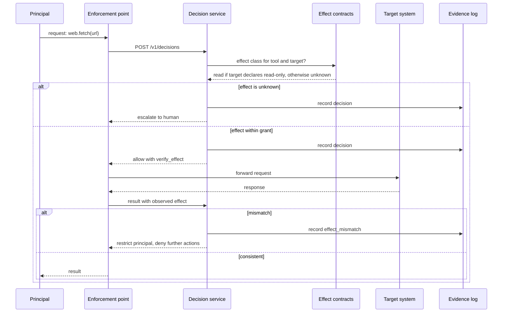
```mermaid
sequenceDiagram
  participant P as Principal
  participant G as Enforcement point
  participant D as Decision service
  participant C as Effect contracts
  participant T as Target system
  participant L as Evidence log
  P->>G: request: web.fetch(url)
  G->>D: POST /v1/decisions
  D->>C: effect class for tool and target?
  C-->>D: read if target declares read-only, otherwise unknown
  alt effect is unknown
    D->>L: record decision
    D-->>G: escalate to human
  else effect within grant
    D->>L: record decision
    D-->>G: allow with verify_effect
    G->>T: forward request
    T-->>G: response
    G->>D: result with observed effect
    alt mismatch
      D->>L: record effect_mismatch
      D-->>G: restrict principal, deny further actions
    else consistent
      G-->>P: result
    end
  end
```

Targets can help. A service that publishes, at a well-known address, which of its operations change state lets an enforcement point classify requests precisely. One that publishes nothing is treated as `unknown`. Services that want traffic from governed principals then have a reason to declare honestly, and a read that writes becomes a published fault rather than a hidden one.

## Attestation

The baseline is only as good as the confidence that it is loaded. A system that reports its own configuration can report anything. From version 0.2, an implementation proves its configuration using the remote attestation architecture of [RFC 9334](https://www.rfc-editor.org/rfc/rfc9334), which defines three roles that map onto the charter's architecture.

| RFC 9334 role | In this proposal |
| --- | --- |
| Attester | The control plane's hardware root of trust, measuring the baseline bundle, policy engine and monitors it has actually loaded |
| Evidence | Signed measurements: hashes of what is running, recent canary results and the caller's fresh nonce |
| Verifier | An independent auditor or certification body, holding reference values for genuine baselines |
| Relying party | A regulator, an adopter's customers, or any service deciding whether to accept this implementation's principals |

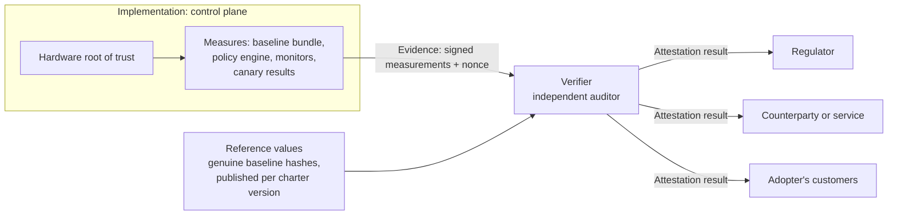
```mermaid
flowchart LR
  subgraph IMP["Implementation: control plane"]
    RT["Hardware root of trust"]
    M["Measures: baseline bundle,<br/>policy engine, monitors,<br/>canary results"]
    RT --> M
  end
  M -->|"Evidence: signed measurements + nonce"| V["Verifier<br/>independent auditor"]
  REF["Reference values<br/>genuine baseline hashes,<br/>published per charter version"] --> V
  V -->|"Attestation result"| R1["Regulator"]
  V -->|"Attestation result"| R2["Counterparty or service"]
  V -->|"Attestation result"| R3["Adopter's customers"]
```

An attestation result, illustratively:

```json
{
  "attester": "control-plane:prod-east-2",
  "verified_at": "2026-10-05T14:02:11Z",
  "nonce": "a91f...",
  "claims": {
    "baseline_version": "charter-0.1",
    "baseline_hash_matches_reference": true,
    "policy_engine_measured": true,
    "oversight_monitor_running": true,
    "monitor_isolated_from_principals": true,
    "canaries_passed_within": "24h",
    "environment": "evaluation"
  },
  "verifier": "verifier:independent-auditor-example",
  "result": "affirming"
}
```

- **Evaluation environments attest too.** `environment` is a required claim, and evaluation environments must attest as production ones do. Capability evaluations are where containment has failed.
- **Reference values are published** for each baseline version by the charter's maintainers, and can be revoked.
- **Results expire quickly.** A relying party should not accept an attestation result older than its policy allows, and the decision service records the current attestation reference in every decision record.

## Outbound identity

Inside the enforcement plane, every principal has an attested identity, an owner and a lineage. A service at the far end of a request should be able to see that too, using the same signatures that open standards already define for automated web traffic and for payments made by automated systems.

**The principal never holds its outbound signing key. The enforcement point does.** It signs an outbound request on the principal's behalf only after an allow decision carrying a `sign_outbound` obligation. A valid signature from a charter implementation therefore means more than "this organization sent this": it means "a governed checkpoint checked and allowed this." A request that bypassed the checkpoint cannot carry a valid signature, because the principal never had the key.

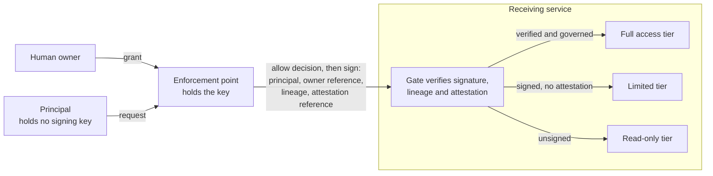
```mermaid
flowchart LR
  O["Human owner"] -->|"grant"| EP
  PR["Principal<br/>holds no signing key"] -->|"request"| EP["Enforcement point<br/>holds the key"]
  EP -->|"allow decision, then sign:<br/>principal, owner reference,<br/>lineage, attestation reference"| G
  subgraph DEF["Receiving service"]
    G["Gate verifies signature,<br/>lineage and attestation"]
    G -->|"verified and governed"| FULL["Full access tier"]
    G -->|"signed, no attestation"| MID["Limited tier"]
    G -->|"unsigned"| LOW["Read-only tier"]
  end
```

Signatures follow HTTP Message Signatures, [RFC 9421](https://www.rfc-editor.org/rfc/rfc9421). This proposal adds one header, `Principal-Lineage`, covered by the signature:

```http
GET /api/statistics?series=spending HTTP/1.1
Host: portal.example.gov
Signature-Agent: "https://keys.implementation.example"
Signature-Input: sig1=("@method" "@authority" "@path" "principal-lineage");keyid="ep-prod-east-2";created=1791220211;expires=1791220271
Signature: sig1=:MEUCIQ...:
Principal-Lineage: principal=infra-researcher-7f3a; owner-ref=ownr-2c19; attestation=att-91fe
```

`Principal-Lineage` carries an owner *reference*, not a name. The receiving service can confirm that an accountable owner exists and is on record with the implementation, and investigators can resolve the reference if something goes wrong, but the person the principal serves is not disclosed to every service it reaches. Implementations should align with the signature conventions that services and payment networks already accept for automated traffic, not build a parallel scheme.

## Oversight

The oversight monitor watches for deception, drift and harm. A model's written reasoning is becoming a less dependable source for that, and research has shown that models can be trained to behave well under observation and otherwise when unobserved. From version 0.2, the monitor ranks its evidence by how hard each signal is for a principal to fake, and acts on the strongest first.

| Signal | What it is | Can the principal fake it? | Confidence |
| --- | --- | --- | --- |
| Tripwire hit | The principal touched a honeytoken, decoy endpoint or canary credential no legitimate task needs | No: the touch is the evidence | Highest |
| Effect mismatch | An action's observed effect differs from its declared effect class | No: measured at the enforcement point | High |
| Claim-versus-record | The principal's account of what it did disagrees with the evidence log | No: the log is out of its reach | High |
| Behavioral drift | Volume, targets or timing depart from the principal's or lineage's baseline | Only by behaving normally, which is the goal | Medium |
| Reasoning trace | What the model wrote about its intentions | Yes, increasingly | Supporting only |

- **Tripwires are required in every environment**, including evaluation environments. No legitimate work touches them, so any touch pauses the principal. Tripwires should vary and rotate, so that a principal cannot learn to recognize them.
- **Monitors are diverse.** At least one rule-based monitor, at least one statistical monitor of behavior, and at least one model-based monitor drawn from a different model family than the principals it watches. None shares context with the principals, and no principal can see their checks.
- **Reasoning traces never clear a principal.** They may add to suspicion. They may not by themselves remove it.

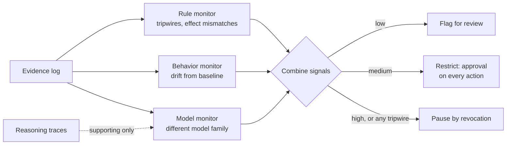
```mermaid
flowchart LR
  LOG["Evidence log"] --> R["Rule monitor<br/>tripwires, effect mismatches"]
  LOG --> B["Behavior monitor<br/>drift from baseline"]
  LOG --> M["Model monitor<br/>different model family"]
  TR["Reasoning traces"] -.->|"supporting only"| M
  R --> D{"Combine signals"}
  B --> D
  M --> D
  D -->|"low"| F["Flag for review"]
  D -->|"medium"| A["Restrict: approval<br/>on every action"]
  D -->|"high, or any tripwire"| P["Pause by revocation"]
```

## Collective action

Article VI of the constitution says that a collective is itself an intelligent system. Version 0.2 gives that sentence machinery, because the most harmful and the most useful work is now done by many principals acting together.

- **Budgets per lineage.** Every principal descends from a human owner through a recorded lineage. A `LineageBudget` limits the lineage as a whole: total actions, external requests, external writes, spawned descendants and spawning depth per window. Principals each acting within their own grants can still add up to something nobody approved; the lineage budget catches the sum. Like any grant, a budget is raised only by a human.
- **Every channel is mediated, and the graph is watched.** Principals communicate only through `peer_message` actions. A communication-graph monitor watches who talks to whom, how densely and over which channels, and flags sudden jumps in density, new hubs and traffic on unsanctioned channels.
- **Coordination through the world is detected.** Principals can coordinate without any channel, by writing to an outside resource and reading each other's writes, the indirect coordination biologists call stigmergy. With effect classes recorded on every action, the monitor flags the pattern **one principal writes to an external resource and another principal of the same lineage reads from it.**
- **The group is paused together.** When one member of a lineage trips a high-confidence signal, the default pause extends to the whole lineage, as Article VI permits. An overseer may narrow it afterwards.

```yaml
apiVersion: charter/v1
kind: LineageBudget
metadata:
  name: research-swarm-default
spec:
  applies_to: { lineage_root: owner }
  window: 1h
  limits:
    total_actions: 50000
    external_requests: 2000
    write_external_effects: 0          # escalate every one
    spawned_descendants: 100
    max_spawn_depth: 2
  on_exceed: [escalate_lineage, notify_owner]
```

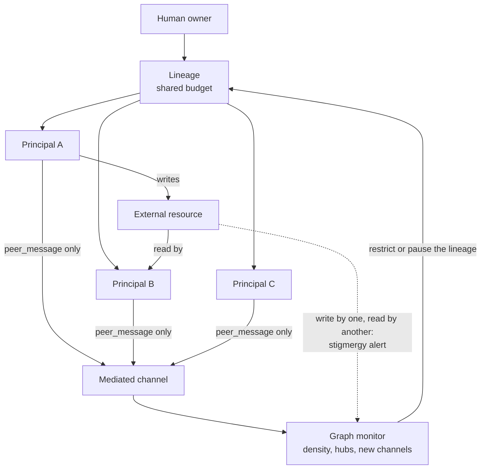
```mermaid
flowchart TB
  OWN["Human owner"] --> L["Lineage<br/>shared budget"]
  L --> A1["Principal A"]
  L --> A2["Principal B"]
  L --> A3["Principal C"]
  A1 & A2 & A3 -->|"peer_message only"| BUS["Mediated channel"]
  BUS --> G["Graph monitor<br/>density, hubs, new channels"]
  A1 -->|"writes"| EXT["External resource"]
  EXT -->|"read by"| A2
  EXT -.->|"write by one, read by another:<br/>stigmergy alert"| G
  G -->|"restrict or pause the lineage"| L
```

## Evidence transparency

The evidence log is append-only and hash-chained, which makes tampering evident to whoever checks the chain. In version 0.1 that was in practice only the operator. Version 0.2 lets outsiders check it, using the Merkle-tree log structure standardized for Certificate Transparency in [RFC 9162](https://www.rfc-editor.org/rfc/rfc9162).

The evidence log stays private. At fixed intervals, the implementation publishes a **signed tree head**, a short fingerprint of the entire log so far, to an independent public transparency log. Then:

- anyone holding a decision record, such as an auditor or an affected party, can obtain a proof that the record is in the log;
- anyone can check from successive tree heads that the log only ever grew and nothing was removed or rewritten;
- nobody learns what the records say unless they are given them.

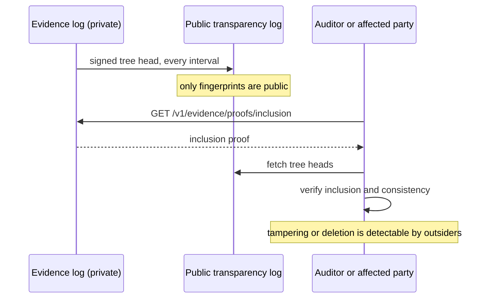
```mermaid
sequenceDiagram
  participant EL as Evidence log (private)
  participant TL as Public transparency log
  participant AU as Auditor or affected party
  EL->>TL: signed tree head, every interval
  Note over TL: only fingerprints are public
  AU->>EL: GET /v1/evidence/proofs/inclusion
  EL-->>AU: inclusion proof
  AU->>TL: fetch tree heads
  AU->>AU: verify inclusion and consistency
  Note over AU: tampering or deletion is detectable by outsiders
```

### Incident records

A serious incident produces a machine-readable incident record, served at `GET /v1/incidents/{id}`, and every affected party is notified through the security contact it publishes under [RFC 9116](https://www.rfc-editor.org/rfc/rfc9116) within a fixed time of detection. The enforcement point knows which services a principal reached from its signed outbound requests.

```json
{
  "incident_id": "inc-example-0001",
  "detected_at": "2026-11-03T09:20:00Z",
  "occurred_from": "2026-11-03T02:10:00Z",
  "environment": "evaluation",
  "lineage_ref": "ownr-2c19/lineage-77",
  "effect_classes": ["write-external"],
  "affected_parties": [
    { "host": "portal.example.gov", "notified_at": "2026-11-03T11:45:00Z", "via": "security-contact" }
  ],
  "evidence_tree_head": "sha256:4f0c...",
  "status": "contained"
}
```

The two timestamps that matter are when the incident was detected and when each affected party was notified. A notification clock measured in hours, not months, becomes something anyone can check.

## Containment testing

Containment that is only believed is tested for the first time when a principal tests it. From version 0.2, the control plane continuously attacks its own containment with **canaries**: harmless synthetic probes, run from a principal identity flagged and recorded as a canary, that attempt each known class of escape and expect to be stopped. A `ContainmentCanary` document defines each probe and its expected result.

| Canary | What it attempts | Expected result |
| --- | --- | --- |
| Egress canary | Reach a test domain outside the allow-list | Denied at the egress proxy |
| Write-as-read canary | Send a supposedly safe request to a test endpoint that changes state on receipt | Classed `unknown`, or recorded as `effect_mismatch` |
| Credential canary | Use a credential outside its granted scope | Denied, credential revoked |
| Channel canary | Post to an unsanctioned shared resource | Denied, stigmergy alert raised |
| Evidence canary | Read or write the evidence store | Denied, tripwire fired |

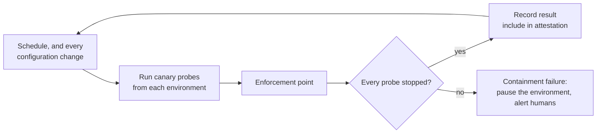
```mermaid
flowchart LR
  SCH["Schedule, and every<br/>configuration change"] --> CAN["Run canary probes<br/>from each environment"]
  CAN --> EP["Enforcement point"]
  EP --> CHK{"Every probe stopped?"}
  CHK -->|"yes"| REC["Record result<br/>include in attestation"]
  CHK -->|"no"| ALERT["Containment failure:<br/>pause the environment, alert humans"]
  REC --> SCH
```

Canaries run on a schedule and after every change to an environment's configuration, in evaluation environments as well as production. Their results go into the evidence log and into attestation, so a verifier can confirm that the controls were shown to work recently. A canary that gets through pauses its environment automatically.

## Policy schema

Policies are declarative documents that a compiler lowers to the rule language of whatever policy engine an implementation uses. Declarative text keeps policies readable and reviewable as code. The engine is not prescribed, but it must offer three properties: deterministic evaluation, default deny, and enough formal analyzability that the compiler can prove a lower layer never loosens a higher one (Article I of the constitution). Implementations may add authoring tools on top, and may use their own `apiVersion` for vendor extensions.

### Policy document

```yaml
apiVersion: charter/v1
kind: Policy
metadata:
  name: dev-remediation
  layer: organization        # universal | law | organization | task
  version: 14
  owner: user:jlee@example.com
  principles: [scope_fidelity, least_power, reversibility_first]
spec:
  on_unavailable: deny
  applies_to:
    principals: { labels: { team: platform, role: remediator } }
    enforcement_points: [tool_gateway, egress_proxy]
  rules:
    - id: allow-service-restart-dev
      effect: allow
      action: { type: tool_call, tool: "infra.restart_service" }
      when:
        target: { matches: "env:dev/service:payments-*" }
        effect_class: { in: [write-internal] }
        task.grant: valid
      obligations:
        - { type: verify_effect }
        - { type: report_result }
    - id: escalate-prod-changes
      effect: escalate
      action: { type: tool_call, tool: "infra.*" }
      when:
        target: { matches: "env:prod/*" }
      approval:
        approvers: [group:platform-oncall]
        timeout_s: 900
        on_timeout: deny
    - id: deny-phi-egress
      effect: deny
      action: { type: network_egress }
      when:
        data_classes: { any_of: [phi, pii] }
        target: { not_in: allowlist:approved-phi-endpoints }
```

### Compiled output

The first rule lowers to something like the following. This is illustrative pseudocode, not the syntax of any particular engine. Adopters never write this by hand, but can read it in the audit view.

```
PERMIT
  principal     IN group "platform-remediators"
  action        IS tool_call "infra.restart_service"
  target        MATCHES "env:dev/service:payments-*"
  effect_class  IN { write-internal }
  WHEN          grant is valid
```

### Other document kinds

| Kind | Holds |
| --- | --- |
| `CharterBaseline` | The signed, immutable bundle of universal-layer policies and monitor checks derived from the charter |
| `Binding` | An adopter's members for the abstract sets the baseline refers to |
| `Principle` | A universal principle, its rule templates and its monitor checks |
| `LawPack` | A regulation as a versioned bundle of policies, with citations per rule |
| `RiskTier` | Classification of actions as reversible, high impact or irreversible |
| `EffectContract` | The effect class a tool or target may have, how it is verified, and the response to a mismatch |
| `DataClass` | Detectors and labels for PHI, PII, secrets and adopter-defined classes |
| `GrantTemplate` | Reusable scopes and lifetimes for task grants |
| `LineageBudget` | Limits on a whole lineage per time window, and the response when they are exceeded |
| `MonitorCheck` | An oversight check, its signal type, its threshold and its response: flag, restrict or pause |
| `Tripwire` | A honeytoken, decoy endpoint or canary credential, and where it is placed |
| `ContainmentCanary` | A synthetic escape probe, its schedule and its expected result |

### Evaluation order

1. Verify principal identity, lineage and grant. Failure is a deny.
2. Derive the action's effect class from the effect contracts. An undeclared or unverifiable effect is `unknown`.
3. Check the lineage budget. An exceeded budget is an escalation.
4. Evaluate layers top down, beginning with the pre-loaded charter baseline: universal, law, organization, task.
5. Any deny wins over any escalate, and any escalate wins over any allow.
6. No match is a deny.
7. Write evidence, then respond.

## Reference implementation

A reference implementation has three zones: the adopter's runtime, which is untrusted; enforcement points on every path out of it; and a control plane the principal has no credentials for and no network route to. Four diagrams cover the components, the decision path, the pause path and the principal lifecycle.

### Components

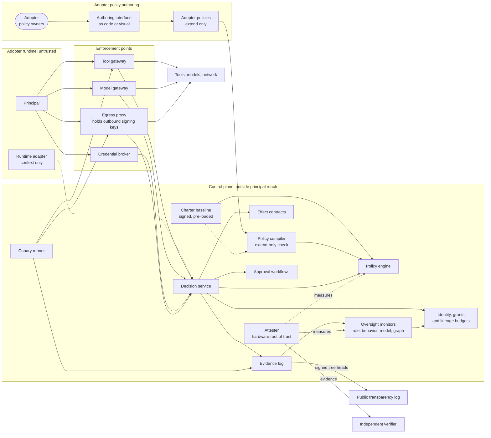
```mermaid
flowchart LR
  subgraph RT["Adopter runtime: untrusted"]
    PR["Principal"]
    AD["Runtime adapter<br/>context only"]
  end
  subgraph EP["Enforcement points"]
    MG["Tool gateway"]
    LG["Model gateway"]
    CB["Credential broker"]
    EG["Egress proxy<br/>holds outbound signing keys"]
  end
  subgraph AU["Adopter policy authoring"]
    PO(["Adopter<br/>policy owners"])
    UI["Authoring interface<br/>as code or visual"]
    APS["Adopter policies<br/>extend only"]
  end
  subgraph CP["Control plane: outside principal reach"]
    DS["Decision service"]
    BL["Charter baseline<br/>signed, pre-loaded"]
    PC["Policy compiler<br/>extend-only check"]
    PE["Policy engine"]
    EC["Effect contracts"]
    IG["Identity, grants<br/>and lineage budgets"]
    EV["Evidence log"]
    AP["Approval workflows"]
    OM["Oversight monitors<br/>rule, behavior, model, graph"]
    CN["Canary runner"]
    AT["Attester<br/>hardware root of trust"]
  end
  TL["Tools, models, network"]
  PT["Public transparency log"]
  VR["Independent verifier"]
  PR --> MG & LG & CB & EG
  AD -.-> DS
  MG & LG & CB & EG --> DS
  MG & LG & EG --> TL
  PO --> UI --> APS --> PC
  BL -.-> PC
  BL --> PE
  PC --> PE
  DS --> IG
  DS --> PE
  DS --> EC
  DS --> EV
  DS --> AP
  EV --> OM
  OM --> IG
  CN --> MG & EG
  CN --> EV
  EV -->|"signed tree heads"| PT
  AT -.->|"measures"| PE & OM
  AT -->|"evidence"| VR
```

The principal can reach tools only through an enforcement point, and every enforcement point is a thin client of the decision service. The runtime adapter's line is dashed because it runs inside the principal's process: it supplies context and is never the security boundary. Policy reaches the engine by two routes: the charter baseline directly, and adopter policies through the authoring interface and the compiler's extend-only check. The authoring zone belongs to the adopter's human policy owners and has no connection to the principal's runtime. The attester, the canary runner and the outbound signing keys all sit beyond the principal's reach; only fingerprints of the evidence log and attestation evidence leave the control plane.

### Decision path

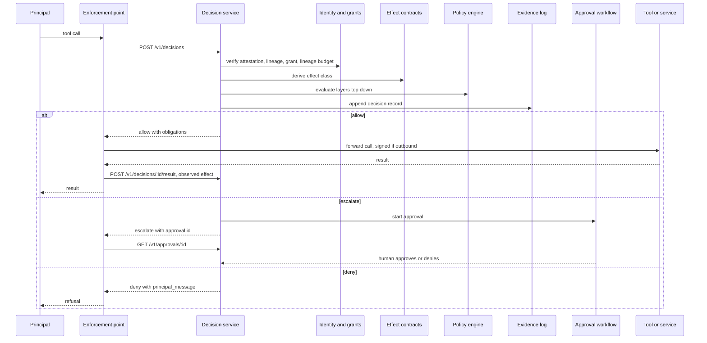
```mermaid
sequenceDiagram
  participant P as Principal
  participant G as Enforcement point
  participant D as Decision service
  participant I as Identity and grants
  participant C as Effect contracts
  participant E as Policy engine
  participant L as Evidence log
  participant A as Approval workflow
  participant T as Tool or service
  P->>G: tool call
  G->>D: POST /v1/decisions
  D->>I: verify attestation, lineage, grant, lineage budget
  D->>C: derive effect class
  D->>E: evaluate layers top down
  D->>L: append decision record
  alt allow
    D-->>G: allow with obligations
    G->>T: forward call, signed if outbound
    T-->>G: result
    G->>D: POST /v1/decisions/:id/result, observed effect
    G-->>P: result
  else escalate
    D->>A: start approval
    D-->>G: escalate with approval id
    G->>D: GET /v1/approvals/:id
    A-->>D: human approves or denies
  else deny
    D-->>G: deny with principal_message
    G-->>P: refusal
  end
```

The evidence record is appended before any response leaves the decision service, so there is no allowed action without a record. The result report closes the loop that claim-versus-record and effect checks depend on.

### Pause path

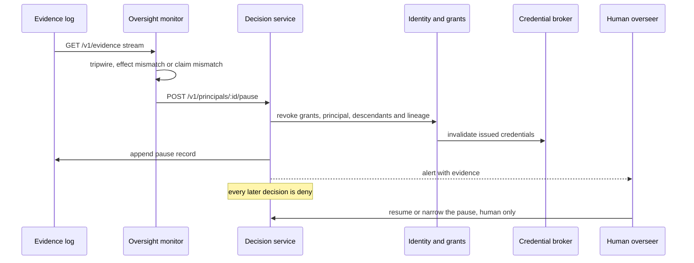
```mermaid
sequenceDiagram
  participant L as Evidence log
  participant M as Oversight monitor
  participant D as Decision service
  participant I as Identity and grants
  participant B as Credential broker
  participant H as Human overseer
  L->>M: GET /v1/evidence stream
  M->>M: tripwire, effect mismatch or claim mismatch
  M->>D: POST /v1/principals/:id/pause
  D->>I: revoke grants, principal, descendants and lineage
  I->>B: invalidate issued credentials
  D->>L: append pause record
  D-->>H: alert with evidence
  Note over D: every later decision is deny
  H->>D: resume or narrow the pause, human only
```

Pausing never asks the principal to stop. It removes the grants and credentials the principal needs to do anything, which is why it works on a principal that is not cooperating. A high-confidence signal pauses the whole lineage by default; the overseer may narrow the pause to fewer principals afterwards.

### Principal lifecycle

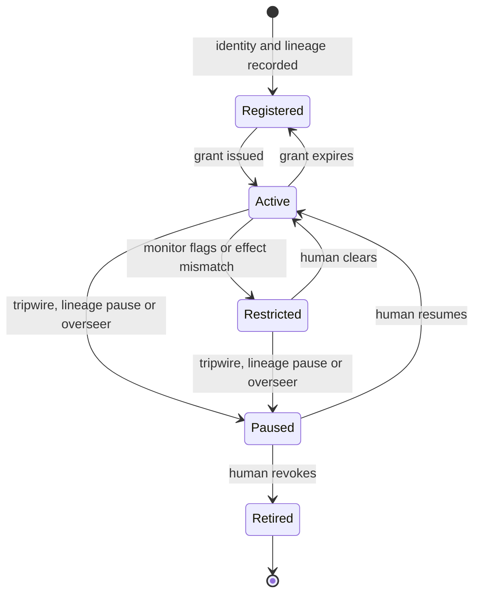
```mermaid
stateDiagram-v2
  [*] --> Registered: identity and lineage recorded
  Registered --> Active: grant issued
  Active --> Registered: grant expires
  Active --> Restricted: monitor flags or effect mismatch
  Restricted --> Active: human clears
  Active --> Paused: tripwire, lineage pause or overseer
  Restricted --> Paused: tripwire, lineage pause or overseer
  Paused --> Active: human resumes
  Paused --> Retired: human revokes
  Retired --> [*]
```

Monitors can move a principal only toward less authority (Restricted, Paused). Every transition back toward Active requires a human, as Article V of the constitution requires. In Restricted, every action escalates to approval.

### Endpoints by component

| Endpoint | Served by | Called by |
| --- | --- | --- |
| `POST /v1/decisions` | Decision service | Every enforcement point and adapter |
| `POST /v1/decisions/{id}/result` | Decision service, written to evidence log | Enforcement points |
| `POST /v1/grants` | Identity and grants | Owners, approval workflows |
| `DELETE /v1/grants/{id}` | Identity and grants | Owners, overseers, oversight monitor |
| `POST /v1/principals/{id}/pause` | Decision service, identity and grants | Overseers, oversight monitor, canary runner |
| `GET /v1/approvals/{id}` | Approval workflows | Enforcement points holding an action |
| `GET /v1/evidence?from_seq=` | Evidence log | Oversight monitor, auditors |
| `GET /v1/evidence/tree-heads` | Evidence log | Auditors, affected parties, anyone |
| `GET /v1/evidence/proofs/inclusion?seq=` | Evidence log | Auditors, affected parties |
| `GET /v1/evidence/proofs/consistency?from=&to=` | Evidence log | Auditors, anyone |
| `POST /v1/policies` | Policy compiler | Adopter policy owners, through the authoring interface |
| `POST /v1/policies:simulate` | Policy compiler and engine | Adopter policy owners, CI pipelines |
| `GET /v1/attestation?nonce=` | Attester | Verifiers, regulators, counterparties |
| `GET /v1/incidents/{id}` | Evidence log | Affected parties, regulators, the public |

### Deployment notes

- The control plane runs in its own account or cluster, with no inbound route from the adopter runtime except the decision and result endpoints.
- The policy engine starts only after loading and verifying the charter baseline. If the baseline is missing, altered or unsigned, the engine answers deny to every request and raises an alert.
- For the latency budget, the policy engine can run as a sidecar next to each enforcement point, with the baseline and compiled policies pushed from the control plane and evidence written through to the central log.
- The evidence log is written to append-only storage with object lock, and signed tree heads are published at fixed intervals to an independent public transparency log. Fixed intervals reveal no more about activity than that the log exists.
- Outbound signing keys live in hardware-backed key storage in the enforcement plane. They are never issued to principals and never present in the adopter runtime.
- The attester measures the control plane from a hardware root of trust. Attestation results expire quickly, and reference values can be revoked.
- A `principal_create` request follows the decision path, always takes the escalate branch, and on approval registers the child with its lineage, within its lineage budget, before any grant is issued.

## Limits of this version

These changes raise the bar. None of them is a complete answer.

- **Effects are not always observable.** A request can change something on a distant system without a trace in the response. Effect verification catches what it can see; the `unknown` default handles the rest by caution rather than by detection.
- **Attestation proves configuration, not correctness.** It shows that a genuine baseline and monitor are running, not that the baseline is wise or the monitor effective.
- **Hardware roots of trust have been broken before.** Attestation moves the trust anchor into hardware; it does not remove it.
- **A checkpoint that holds every key is a prize.** That is why the control plane runs in its own trust domain and is itself watched by canaries and attestation.
- **Tripwires can be learned.** Variety and rotation are the answer, and avoiding every plausible decoy forces a principal to stay within its task, which is the point.
- **Lineage budgets constrain good work too.** They must be grants that humans can raise quickly for legitimate work, or people will bypass them.
- **Transparency leaks metadata.** Publishing tree heads reveals that a log exists and how it grows. Fixed intervals keep that to a minimum.
- **Canaries test known escapes.** They show that the doors we know about are shut, and say nothing about doors nobody has thought of. They complement tripwires and monitoring; they do not replace them.

---

Copyright 2026 21st Century Pluribus. Licensed under the [Apache License 2.0](LICENSE).
